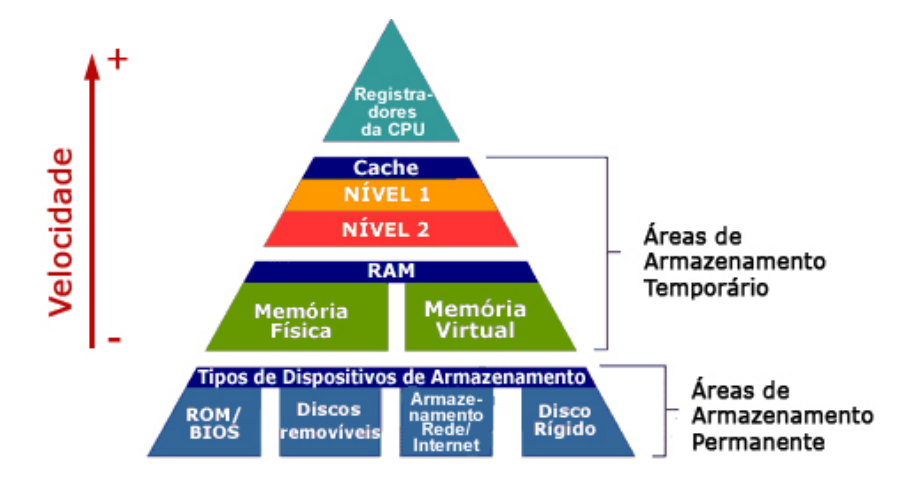

# Introdução a Organização e Arquitetura de Computadores

- **Arquitetura de um Computador:** trata-se dos atributos de um sistema que são visíveis para o programador e que viabilizam a execução lógica de um programa;

- **Organização de um Computador:** refere-se às unidades operacionais e suas interconexões que implementam as especificações da sua arquitetura.

## Estrutura interna do Computador

- Unidade Central de Processamento (*Central Processing Unit*): trata-se do processador, que controla a operação do computador e desempenha funções de processamento de dados. É a parte do computador que busca e executa instruções, consistindo de uma unidade de lógica e aritmética (ULA), uma unidade de controle e registradores;
- Memória Principal: local responsável pelo armazenamento de dados;
- Entrada e Saída (*Input/Output* - IO): dispositivos responsáveis pela transferência de dados entre o computador e o ambiente externo;
- Sistema de interconexão: mecanismos que estabelecem a comunicação entre a CPU, a memória principal e os dispositivos de I/O.

## Unidade Central de Processamento

Trata-se da unidade funcional do computador que interpreta e executa instruções. Seguem alguns conceitos importantes:

- Unidade de Controle: é a parte da CPU que controla a execução de operações na CPU, incluindo operações da ULA, movimentação de dados dentro da CPU e troca de dados e sinais de controle por meio de interfaces externas (por exemplo, através do barramento de sistema);
- Unidade de Lógica e Aritmética: é a unidade que efetua operações lógicas e aritméticas

Ações da CPU:

1) Busca da instrução: a CPU lê uma instrução da memória;
2) Interpretação da instrução: a instrução é decodificada para determinação da ação requerida;
3) Busca de dados: a execução de uma instrução pode demandar a leitura de dados da memória ou de um módulo de I/O;
4) Processamento de dados: a execução de uma instrução pode demandar a execução de operações aritméticas ou lógicas sobre os dados;
5) Escrita de dados: os resultados dessas execuções podem requerer a escrita de dados na memória ou em um módulo de I/O.

## Memória

- Memória de Acesso Aleatório (*Random Access Memory* - RAM): memória na qual cada posição endereçável tem um mecanismo de endereçamento distinto. O tempo de acesso a uma dada posição é independente da sequência de acessos anteriores;
- Memória Principal: memória endereçável por programa, a partir da qual dados e instruções podem ser diretamente carregados em registradores, para subsequente processamento ou execução;
- Memória Secundária: memória localizada fora do próprio sistema de computador como, por exemplo, os discos rígidos;
- Memória Virtual: espaço de armazenamento que pode ser visto como o armazenamento principal endereçável pelo usuário do computador, no qual um endereço virtual é convertido em um endereço real. O tamanho da memória virtual é 
- Registradores: trata-se da memória interna rápida da CPU. Alguns registradores podem ser utilizados diretamente pelo programador por meio do conjunto de instruções de máquina

# Referências

Livro do William Stallings - Arquitetura e Organização de Computadores - 10a edição

