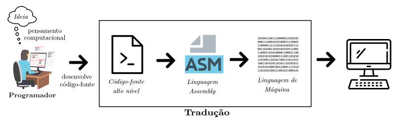
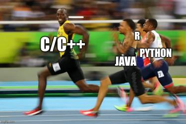

# Software Básico

## Definição de Algoritmo

Um **algoritmo** é uma sequência finita de passos . Existem diversas maneiras de representação de um algoritmo, variando-se desde as abordagens mais próximas à nossa linguagem natural até os algoritmos computacionais. Por exemplo, uma representação alto nível de um algoritmo é a abordagem descritiva, que consiste em enumerar um passo-a-passo de como resolver um problema.

Vale ressaltar que o propósito do algoritmo é sempre o mesmo: descrever uma sequência de passos que fazem sentido a fim de se obter uma saída esperada ao resolver um problema a partir de dados de entrada.

Veja a seguir diferentes representações para o problema de imprimir a soma de dois números que são fornecidos como entrada:

### Algoritmo Descritivo

```
1) Solicite que o usuário informe um número inteiro a por meio do teclado
2) Guarde esse valor na variável a
3) Solicite que o usuário informe um número inteiro b por meio do teclado
4) Guarde esse valor na variável b
5) Some a e b e armazene o resultado na variável s
6) Imprima na tela o valor da variável s
```

### Pseudo-código

```
a <- Ler_Inteiro()
b <- Ler_Inteiro()

s <- a+b

Imprimir(s)
```

### Algoritmo computacional


```
a = int(input("Informe o valor do numero a: "))
b = int(input("Informe o valor do numero b: "))

s=a+b
print(f"Soma de a e b eh: {s}")
```

## O Processo de Tradução



### Linguagem em Alto Nível

Se tratam dos algoritmos computacionais descritos em alguma linguagem de programação. Compare os dois códigos-fontes escritos nas linguagens Python e C, respectivamente (observe a diferença na sintaxe, estrutura e nome dos comandos):

**Python**
```
a = int(input("Informe o valor do numero a: "))
b = int(input("Informe o valor do numero b: "))

s=a+b
print(f"Soma de a e b eh: {s}")
```

**C**
```
#include<stdio.h>

int main(){
	int a,b,s;
	
	printf("Informe o valor do numero a: \n");
	scanf("%d",&a);
	printf("Informe o valor do numero b: \n");
	scanf("%d",&b);
	
	s=a+b;
	
	printf("Soma de a e b eh: %d\n",s);
	
	return 0;
}
```

### Linguagem de Montagem

Também conhecida como *Assembly*, é uma linguagem de nível intermediária entre a linguagem de alto nível e a linguagem de máquina. O Assembly possui uma sintaxe que é legível por humanos, mas que permite representar textualmente o conjunto de instruções de máquina (ISA) do computador.

O uso de uma linguagem de montagem tem como vantagens a melhora no desempenho do processo de tradução do código-fonte/script em linguagem de alto nível para a linguagem de máquina. Antigamente, nem sempre todos os computadores possuíam compiladores/interpretadores para rodar um programa escrito em determinada linguagem, então a linguagem de montagem, apesar da sintaxe mais complicada, se mostrou uma opção viável.

O exemplo é o resultado da conversão do código-fonte anterior em Assembly:

```
.data
               
.text
 
main:                  
	li $s0, 10
	li $s1, 17
	add $s2,$s1,$s0

	li $v0,1
	la $a0, ($s2)
	syscall

	li $v0, 10
	syscall
```

Um programa denominado **montador** é designado para converter os comandos/instruções Assembly em linguagem de máquina. Tal conversão depende da arquitetura do sistema computacional associado e da especificação do processador, não sendo portanto, única. No exemplo acima, é apresentado o código em linguagem Assembly MIPS (de *Microprocessor without Interlocked Pipeline Stages*), apesar de existirem outros tipos como x86.

PS.: o propósito do MIPS é bem diferente do x86, já que baseiam em diferentes tipos de conjuntos de instruções! O MIPS se baseia em um conjunto reduzido de instruções, enquanto que o Assembly x86 se baseia em arquiteturas com conjuntos complexos de instrulões. Mas isso é conversa para outra disciplina: *Organização e Arquitetura de Computadores*.


### Linguagem de Máquina

Também conhecida como código de máquina, é a linguagem padrão dos computadores. A informação está representada por bits (zero e um), sendo lida, armazenada e processada pela unidade central de processamento (CPU). A linguagem de máquina também pode ser expressa em notação hexadecimal.

```
010101010101010101010000000111100101010111100000000110101010001010101010101010101010101010101010101010001111100101010101010110010011001011001001010100111
000110001010011001010101010101010101000000011110010101011110000000011010101000101010101010101010101010101010101010101000111110010101010101011001001100101
100100101010011100011000101001100101010101010101010100000001111001010101111000000001101010100010101010101010101010101010101010101010100011111001010101010
101100100110010110010010101001110001100010100110010101010101010101010000000111100101010111100000000110101010001010101010101010101010101010101010101010001
111100101010101010110010011001011001001010100111000110001010011001010101010101010101000000011110010101011110000000011010101000101010101010101010101010101
010101010101000111110010101010101011001001100101100100101010011100011000101001100101010101010101010100000001111001010101111000000001101010100010101010101
010101010101010101010101010100011111001010101010101100100110010110010010101001110001100010100110010101010101010101010000000111100101010111100000000110101
010001010101010101010101010101010101010101010001111100101010101010110010011001011001001010100111000110001010011001010101010101010101000000011110010101011
110000000011010101000101010101010101010101010101010101010101000111110010101010101011001001100101100100101010011100011000101001100101010101010101010100000
001111001010101111000000001101010100010101010101010101010101010101010101010100011111001010101010101100100110010110010010101001110001100010100110010101010
101010101010000000111100101010111100000000110101010001010101010101010101010101010101010101010001111100101010101010110010011001011001001010100111000110001
```


## Compilação

A **compilação** transforma o código-fonte escrito em uma linguagem de programação em alto nível em linguagem de máquina de uma única vez antes do programa ser executado.

- O **compilador** apresenta todos os erros no código-fonte após o processo de compilação;

Exemplos de linguagens compiladas: C, C++, Pascal, Rust

## Interpretação

A **interpretação** é a abordagem que converte cada comando/instrução em um programada desenvolvido em linguagem de alto nível em um respectivo comando/instrução em linguagem de máquina durante a execução do programa.

O programa que interpreta um código-fonte e possibilita sua execução é o **interpretador**. O interpretador é um programa que converte cada comando/instrução do código-fonte/script diretamente em linguagem de máquina. A tarefa do compilador e do interpretador é a mesma: converter o código-fonte em linguagem em alto nível para linguagem de máquina.

- O **interpretador** mostra os erros de cada linha, uma a uma, durante a execução do programa associado ao código-fonte/script passado como entrada.

Exemplos de linguagens interpretadas: Python, R, Matlab, Javascript, Ruby, Perl, PHP

## Comparativo Interpretação vs Compilação

- Programas compilados rodam mais rápido quando comparados aos programas baseados em linguagem interpretadas, sendo menos dependentes do desempenho do sistema operacional e da qualidade do hardware.

- 

## Para rir


