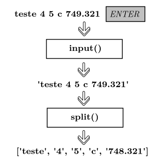

# Exemplos de leitura e escrita de dados em Python

## Leitura

Em Python, a leitura de dados da entrada padrão é feita por meio da função [input](https://docs.python.org/3/tutorial/inputoutput.html).

A função retorna 



### Leitura de um número em uma linha

```
value = input()
value = int(value)
```

de maneira simplificada

```
value = int(input())
```

### Leitura de um número em uma linha com pergunta

**Não utilize essa abordagem em juízes automáticos ou ambiente com correção automática, como Coderunner, Codeforces e Beecrowd**

```
value = input("Digite um numero inteiro: ")
value = int(value)
```

de maneira simplificada

```
value = int(input("Digite um numero inteiro: "))
```

### Leitura de dois números inteiros separados por espaço em branco

Estratégia 1

```
a,b = (x for x in input().split())
a = int(a)
b = int(b)
```

de maneira simplificada:

```
a,b = (int(x) for x in input().split())
```

Estratégia 2

```
a,b = map(int, input().split())
```

### Leitura de três números inteiros separados por espaço em branco

Estratégia 1

```
a,b,c = (int(x) for x in input().split())
```

Estratégia 2

```
a,b,c = map(int, input().split())
```

## Escrita

### Escrita de um número inteiro

Estratégia 1 

```
value = 1234
print(f'Valor: {value}')
```

Estratégia 2: método format

```
value = 1234
print('Valor: {:d}'.format(value))
```

### Escrita de um número real com três casas decimais de precisão

Estratégia 1 

```
value = 1234.56234536457
print(f'Valor: {value:.3f}')
```

Estratégia 2: método format

```
value = 1234.56234536457
print('Valor: {:.3f}'.format(value))
```

### Escrita de um número inteiro com exatamente 7 digitos inteiros à esquerda

Espaçamento em branco

```
value = 1234
print(f'Valor: {value:7d}')
```

Com zeros à esquerda

```
value = 1234
print(f'Valor: {value:07d}')
```

## Referências

- [Documentação do Python](https://docs.python.org/3/tutorial/inputoutput.html).

- [Material IME/USP](https://panda.ime.usp.br/panda/static/pythonds_pt/01-Introducao/09-entradaSaida.html)
